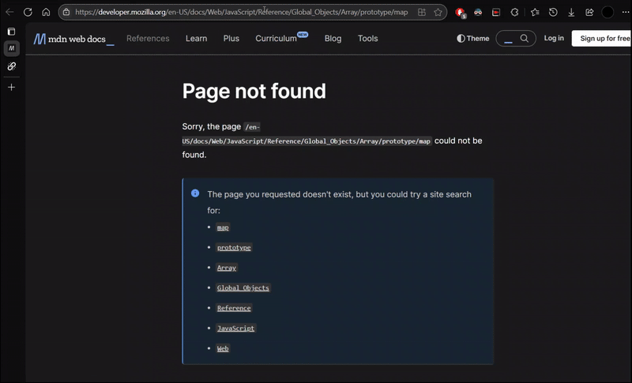
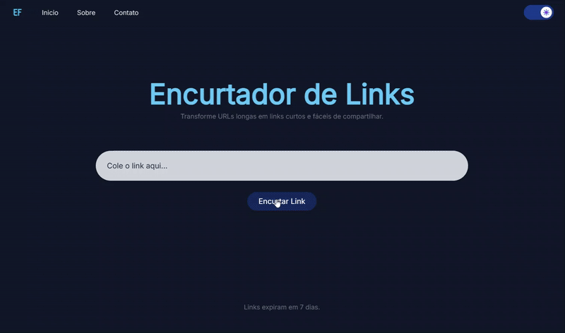
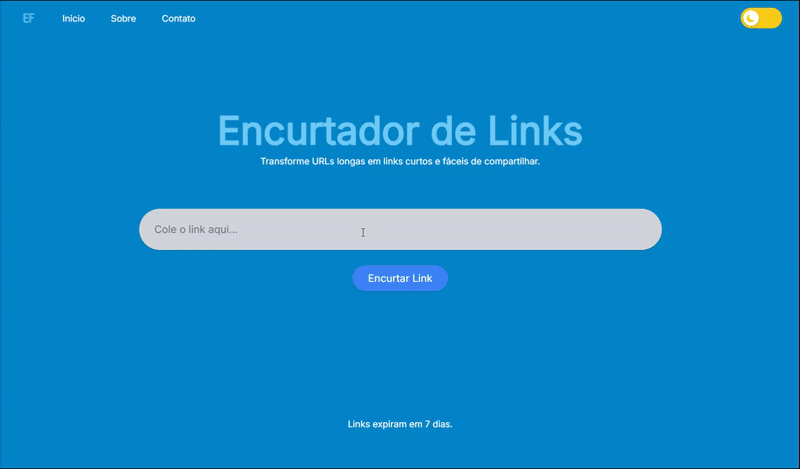

# Encurtador de Links

Um encurtador de URLs simples e elegante feito com Flask, permitindo transformar links longos em URLs curtas, ideais para compartilhamento. O projeto inclui uma interface moderna com suporte a temas claro/escuro, além de funcionalidades úteis como expiração automática dos links após 7 dias.

[](https://l1nksh0rtef.onrender.com)
[](https://www.python.org/)
[](https://flask.palletsprojects.com/)
[](https://www.sqlite.org/)
[](https://tailwindcss.com/)
[](LICENSE)

#

## Funcionalidades
**1.** Encurta links longos

**2.** Links expiram automaticamente após 7 dias

**3.** Alternância entre modo claro e escuro

**4.** Redirecionamento automático de URLs curtas

**5.** Validação de links

**6.** Interface estilizada com TailwindCSS

**7.** Armazenamento usando SQLite

## 📸 Demonstração



## Estrutura do Projeto

```

link-shortener/
│
├── .venv/                  # Ambiente virtual (não versionado)
├── instance/
│   └── database.db         # Banco de dados SQLite
│
├── models/
│   └── models.py           # Modelo de dados para os links
│
├── static/
│   ├── images/             # Imagens estáticas (logo, ícone, banner)
│   ├── scripts/
│   │   └── script.js       # Script JS (tema escuro/claro)
│   └── styles/
│       └── style.css       # Estilos personalizados
│
├── templates/
│   ├── base.html           # Template base com navbar e footer
│   ├── index.html          # Página principal
│   ├── about.html          # Página "Sobre o Projeto"
│   ├── contact.html        # Página de contato
│   ├── link_expired.html   # Página de link expirado
│   └── 404.html            # Página de erro 404
│
├── app.py                 # Arquivo principal da aplicação Flask
├── extensions.py          # Inicialização do SQLAlchemy
├── requirements.txt       # Dependências do projeto
└── LICENSE                # Licença MIT

```

## Como funciona

- O usuário insere uma URL na página inicial.

- O sistema verifica se é um link válido.

- Um código aleatório é gerado (combinação de letras e UUID).

- O link encurtado é armazenado no banco de dados com a data de criação.

- Ao acessar o link curto, o usuário é redirecionado — caso o link tenha expirado (após 7 dias), uma página especial é exibida.

## Instalação

**1.** Clone o repositório:

```
git clone https://github.com/emilyfas/link-shortener.git
cd link-shortener
```

**2.** Crie e ative o ambiente virtual:
```
python -m venv .venv
source .venv/bin/activate  # Linux/Mac
.venv\Scripts\activate     # Windows
```

**3.** Instale as dependências:
```
pip install -r requirements.txt
```

**4.** Execute a aplicação:
```
flask run
Acesse em: http://localhost:5000
```

## Tecnologias Utilizadas

- Python 3

- Flask

- SQLite + SQLAlchemy

- HTML + TailwindCSS

- JavaScript

## Licença

Distribuído sob a licença MIT. Veja o arquivo `LICENSE` para mais informações.

## Autora  

**Emilly Fernandes**   
Estudante de Ciência da Computação   
Projeto desenvolvido para portfólio pessoal.   
[LinkedIn](https://www.linkedin.com/in/emilly-fernandes) | [Portfólio](https://emilyfas.github.io/meu-portfolio/)

