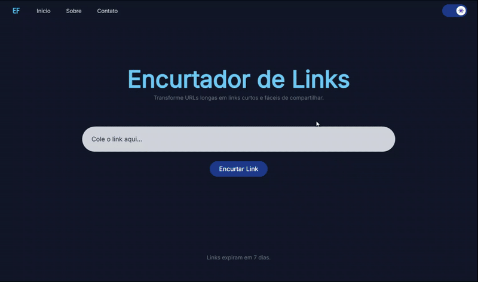

# Encurtador de Links
Um encurtador de URLs simples e elegante feito com Flask, permitindo transformar links longos em URLs curtas, ideais para compartilhamento. O projeto inclui uma interface moderna com suporte a temas claro/escuro, além de funcionalidades úteis como expiração automática dos links após 7 dias.

## 📸 Demonstração

Demonstração

## Funcionalidades
**1.** Encurta links longos

**2.** Links expiram automaticamente após 7 dias

**3.** Alternância entre modo claro e escuro

**4.** Redirecionamento automático de URLs curtas

**5.** Validação de links

**6.** Interface estilizada com TailwindCSS

**7.** Armazenamento usando SQLite

